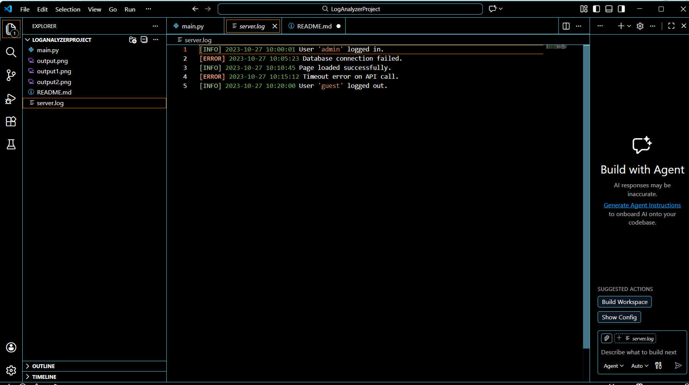
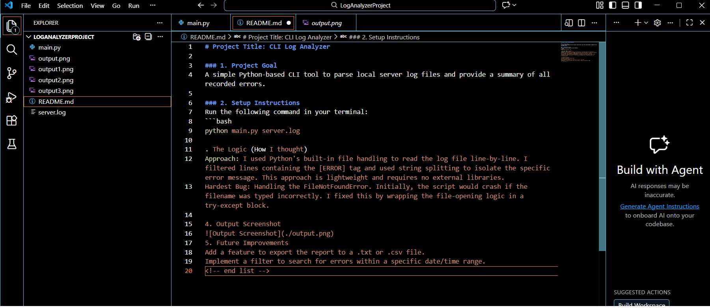
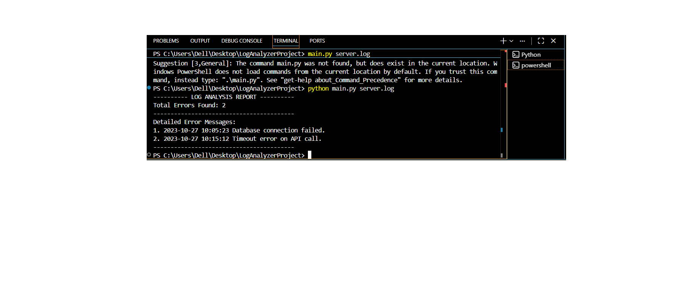
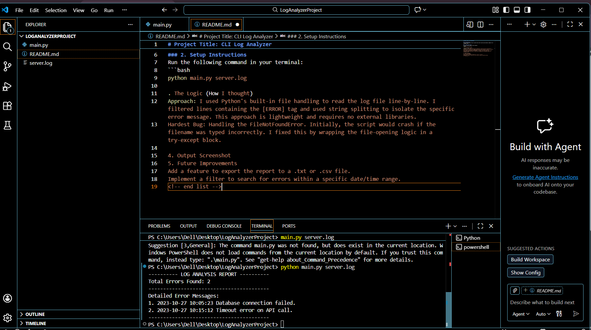

# Project Title: CLI Log Analyzer

### 1. Project Goal
A simple Python-based CLI tool to parse local server log files and provide a summary of all recorded errors.

### 2. Setup Instructions
Run the following command in your terminal:
```bash
python main.py server.log

. The Logic (How I thought)
​Approach: I used Python's built-in file handling to read the log file line-by-line. I filtered lines containing the [ERROR] tag and used string splitting to isolate the specific error message. This approach is lightweight and requires no external libraries.

​Hardest Bug: Handling the FileNotFoundError. Initially, the script would crash if the filename was typed incorrectly. I fixed this by wrapping the file-opening logic in a try-except block.

### 4. Output Screenshots

**1. Project Initiation**
> Description: Creating the initial local project directory `LogAnalyzerProject` to organize all required source files.


**2. Python Source Code**
> Description: The core logic in `main.py` that reads the log file, filters `[ERROR]` lines, and handles potential file errors.


**3. Input Data**
> Description: The raw `server.log` file containing sample `[INFO]` and `[ERROR]` entries used for testing the script.


**4. Project Documentation**
> Description: Finalizing the Golden README with setup instructions, logic explanation, and embedded proof of work.


**5. Command Execution**
> Description: Running the script in the terminal using the command `python main.py server.log`.


**6. Final Analysis Report**
> Description: The successful terminal output showing the total error count and specific error messages extracted.


​5. Future Improvements
​Add a feature to export the report to a .txt or .csv file.
​Implement a filter to search for errors within a specific date/time range.
​<!-- end list -->